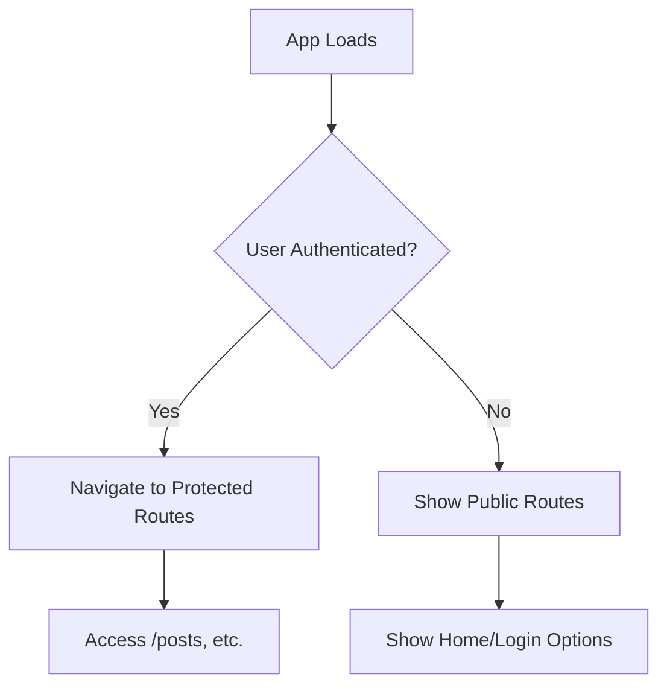
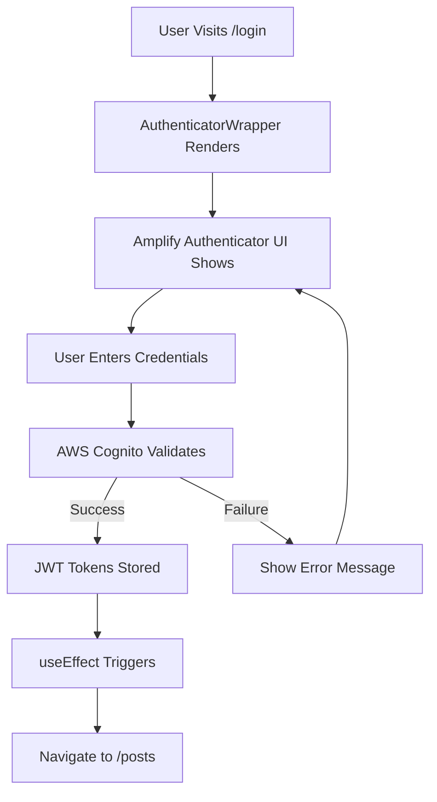
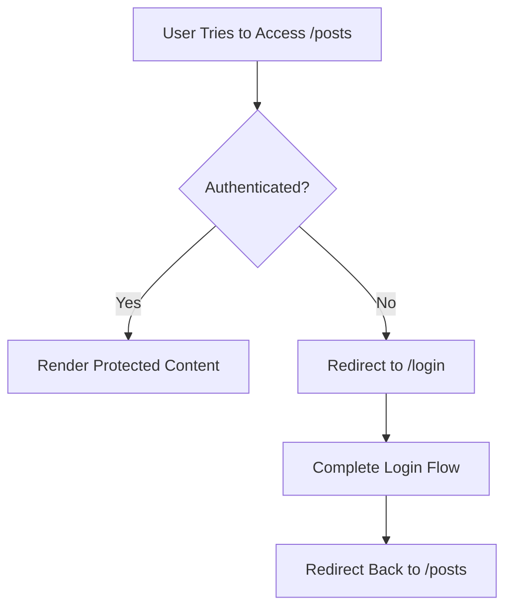

# 🔐 Authentication with AWS Amplify & TanStack Router

This document explains how authentication is implemented in this template using AWS Amplify's Authenticator component integrated with TanStack Router for a seamless full-stack authentication experience.

## Overview

The authentication system combines:
- **AWS Cognito User Pools** for user management
- **AWS Amplify UI Authenticator** for pre-built authentication components
- **TanStack Router** for type-safe routing and navigation
- **Protected routes** with automatic redirects

## Architecture

```
┌─────────────────┐    ┌──────────────────┐    ┌─────────────────┐
│   User Login    │───▶│  AWS Cognito     │───▶│  TanStack       │
│   Component     │    │  Authentication  │    │  Router         │
└─────────────────┘    └──────────────────┘    └─────────────────┘
         │                       │                       │
         │                       │                       ▼
         │                       │              ┌─────────────────┐
         │                       │              │  Protected      │
         │                       │              │  Routes         │
         │                       │              └─────────────────┘
         │                       │                       │
         ▼                       ▼                       ▼
┌─────────────────┐    ┌──────────────────┐    ┌─────────────────┐
│  Amplify UI     │    │  JWT Tokens      │    │  /posts         │
│  Components     │    │  Session Mgmt    │    │  Redirect       │
└─────────────────┘    └──────────────────┘    └─────────────────┘
```

## Key Components

### 1. AuthenticatorWrapper Component

Located at `src/components/AuthenticatorWrapper.tsx`, this is the main authentication wrapper that:

- **Wraps the Amplify Authenticator**: Provides the authentication UI
- **Handles post-login redirects**: Automatically navigates to `/posts` after successful authentication
- **Customizes the UI**: Includes custom header, footer, and form field configurations
- **Manages themes**: Applies custom Amplify UI theming

```tsx
// Key features of AuthenticatorWrapper:
export function AuthenticatorWrapper({ children }: AuthenticatorWrapperProps) {
  return (
    <ThemeProvider theme={amplifyTheme}>
      <Authenticator
        signUpAttributes={['email']}
        socialProviders={[]}
        components={{
          Header() { /* Custom header */ },
          Footer() { /* Custom footer */ }
        }}
        formFields={{
          signIn: { /* Custom sign-in fields */ },
          signUp: { /* Custom sign-up fields */ }
        }}
      >
        <AuthenticatedContent>{children}</AuthenticatedContent>
      </Authenticator>
    </ThemeProvider>
  );
}
```

### 2. AuthenticatedContent Component

A separate component that handles the redirect logic:

```tsx
function AuthenticatedContent({ children }: { children: React.ReactNode }) {
  const { user } = useAuthenticator();
  const router = useRouter();

  // Auto-redirect to posts page after successful authentication
  useEffect(() => {
    if (user) {
      router.navigate({ to: '/posts' });
    }
  }, [user, router]);

  return <>{children}</>;
}
```

**Why separate?** This prevents React Hook order violations by ensuring hooks are called consistently outside of render prop patterns.

### 3. Protected Routes Structure

The application uses TanStack Router's layout routes for protection:

```
src/routes/
├── __root.tsx          # Root layout
├── index.tsx           # Public home page
├── login.tsx           # Login page
├── _authed.tsx         # Protected route layout
└── _authed/            # Protected routes directory
    ├── posts.route.tsx # Posts layout
    ├── posts.index.tsx # Posts list
    ├── posts.new.tsx   # Create post
    └── posts.$postId.tsx # Individual post
```

### 4. Authentication Hook

Located at `src/hooks/useAuth.ts`, provides authentication utilities:

```tsx
export function useAuth() {
  const { user, signOut } = useAuthenticator();
  
  return {
    user,
    isAuthenticated: !!user,
    signOut: () => signOut(),
    // Additional auth utilities
  };
}
```

## Authentication Flow

### 1. Initial Load


### 2. Login Process


### 3. Protected Route Access


## Route Protection Implementation

### Layout Route Protection (`_authed.tsx`)

```tsx
export const Route = createFileRoute('/_authed')({
  beforeLoad: async ({ context }) => {
    // Check authentication status
    if (!context.auth.isAuthenticated) {
      throw redirect({
        to: '/login',
        search: {
          redirect: location.href, // Remember where they wanted to go
        },
      });
    }
  },
  component: AuthedLayout,
});
```

### Benefits of This Approach

1. **Automatic Protection**: All routes under `_authed/` are automatically protected
2. **Type Safety**: TanStack Router provides full TypeScript support
3. **Redirect Handling**: Users are redirected back to their intended destination after login
4. **Layout Sharing**: Common authenticated layout (navigation, etc.) is shared

## Session Management

### JWT Token Handling
- **Automatic Storage**: Amplify automatically stores JWT tokens securely
- **Token Refresh**: Handles token refresh automatically
- **Cross-Tab Sync**: Authentication state syncs across browser tabs

### Authentication State
```tsx
// Access authentication state anywhere in the app
const { user, signOut } = useAuthenticator();

// Or use the custom hook
const { isAuthenticated, user, signOut } = useAuth();
```

## Customization Options

### 1. Authentication UI Customization

```tsx
// In AuthenticatorWrapper.tsx
<Authenticator
  components={{
    Header() {
      return <YourCustomHeader />;
    },
    Footer() {
      return <YourCustomFooter />;
    },
    SignIn: {
      Header() {
        return <CustomSignInHeader />;
      }
    }
  }}
/>
```

### 2. Form Field Customization

```tsx
formFields={{
  signIn: {
    username: {
      label: 'Email Address',
      placeholder: 'Enter your email',
      isRequired: true,
    }
  },
  signUp: {
    email: { /* custom config */ },
    password: { /* custom config */ },
    // Add custom attributes
    given_name: {
      label: 'First Name',
      placeholder: 'Enter your first name',
      isRequired: true,
      order: 1,
    }
  }
}}
```

### 3. Social Providers

```tsx
<Authenticator
  socialProviders={['google', 'facebook', 'amazon']}
  // Configure in amplify/auth/resource.ts
/>
```

### 4. Post-Login Redirect Customization

```tsx
// Modify AuthenticatedContent component
useEffect(() => {
  if (user) {
    // Custom redirect logic
    const redirectTo = searchParams.get('redirect') || '/dashboard';
    router.navigate({ to: redirectTo });
  }
}, [user, router]);
```

## Security Considerations

### 1. Route Protection
- All sensitive routes are protected at the layout level
- Authentication checks happen before route components load
- Automatic redirects prevent unauthorized access

### 2. Token Security
- JWT tokens are stored securely by Amplify
- Automatic token refresh prevents session expiration
- Tokens are included in API requests automatically

### 3. CSRF Protection
- AWS Cognito provides built-in CSRF protection
- Amplify handles secure token transmission

## Troubleshooting

### Common Issues

1. **Hook Order Violations**
   - Ensure hooks are not called conditionally
   - Use separate components for authentication logic

2. **Redirect Loops**
   - Check authentication state properly
   - Ensure protected routes don't redirect authenticated users to login

3. **Token Expiration**
   - Amplify handles refresh automatically
   - Implement proper error handling for expired sessions

### Debug Authentication State

```tsx
// Add to any component for debugging
const { user, authStatus } = useAuthenticator();
console.log('Auth Status:', authStatus);
console.log('User:', user);
```

## Best Practices

1. **Separate Concerns**: Keep authentication logic separate from business logic
2. **Use Layout Routes**: Protect multiple routes efficiently with layout routes
3. **Handle Loading States**: Show appropriate loading indicators during auth checks
4. **Error Handling**: Implement proper error boundaries for auth failures
5. **Testing**: Test both authenticated and unauthenticated states

## Integration with Backend

The authentication integrates seamlessly with the AWS Amplify backend:

- **GraphQL API**: Automatically includes authentication headers
- **DynamoDB**: User-based authorization rules
- **Real-time Subscriptions**: Authenticated subscriptions only

```typescript
// In amplify/data/resource.ts
const schema = a.schema({
  Post: a.model({
    title: a.string().required(),
    content: a.string().required(),
  }).authorization((allow) => [
    allow.authenticated() // Only authenticated users can access
  ])
});
```

This creates a complete, secure authentication system that scales with your application needs while maintaining type safety and developer experience.
